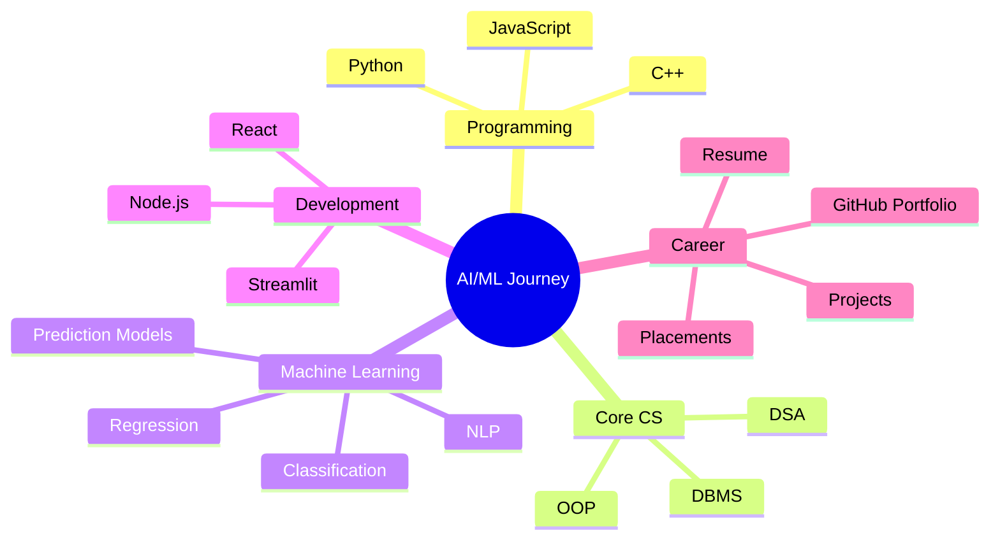

<!-- Futuristic GitHub Profile README for sameerpatil05 -->

<div align="center">


<br/>


</div>

---

## 🧑‍💻 About Me

Hi, I am **Samir Patil**, a Computer Engineering student and aspiring **AI/ML Engineer**.

I am focused on building practical projects in **Machine Learning, AI applications, Python, DSA, and full-stack development**.  
My goal is to create projects that are not only technically strong, but also useful for real-world problems, placements, and startup-level ideas.

---

## 🚀 Current Mission

```txt
Python → DSA → Machine Learning → AI Projects → Deployment → Job Ready Portfolio
```

- 🔭 Currently working on **AI/ML and placement-focused projects**
- 🧠 Learning **Machine Learning, NLP, DSA, and full-stack development**
- 🛠️ Building projects using **Python, Streamlit, JavaScript, React, and Node.js**
- 🎯 Goal: Become a skilled **AI/ML Engineer**
- 💡 Interested in projects that solve **education, career, prediction, and automation problems**

---

## 🛠️ Tech Arsenal

<div align="center">


</div>

<br/>

<div align="center">


</div>

---

## 🌌 Featured Projects

<table>
<tr>
<td width="50%">

### 🧠 ReviewSense
NLP-based sentiment analysis project that analyzes user reviews and predicts customer sentiment.

**Tech Stack:** Python, NLP, Machine Learning, Streamlit

</td>
<td width="50%">

### 🎓 EduPath AI
AI-powered career and education guidance system for students.

**Tech Stack:** Python, AI/ML, Recommendation System

</td>
</tr>

<tr>
<td width="50%">

### 📁 Project Submission System
A web-based system for managing student project submissions.

**Tech Stack:** Web Development, JavaScript, Database

</td>
<td width="50%">

### 📊 Customer Purchase Prediction
Machine learning project for predicting customer purchase behavior.

**Tech Stack:** Python, ML, Data Analysis

</td>
</tr>

<tr>
<td width="50%">

### 🤖 AI Agent
Agentic AI project focused on automation and intelligent task handling.

**Tech Stack:** TypeScript, AI Agents, Automation

</td>
<td width="50%">

### 💻 DSA Practice
Repository for coding practice, problem solving, and placement preparation.

**Tech Stack:** C++, Arrays, Strings, Logic Building

</td>
</tr>
</table>

---

## 📊 GitHub Analytics

<div align="center">


</div>

<br/>

<div align="center">


</div>

---

## 🧬 AI/ML Learning Matrix



---

## ⚡ What I Am Building Next

- 🎓 **EduPath AI** — personalized career and education guidance system
- 📈 ML dashboards for prediction-based projects
- 🤖 AI agents for automation
- 🧠 NLP-based real-world applications
- 💼 Placement-ready portfolio projects

---

## 🏆 GitHub Profile Trophy

<div align="center">


</div>

---

## 📈 Contribution Graph

<div align="center">


</div>

---

## 🌐 Connect With Me

<div align="center">

<a href="https://github.com/sameerpatil05">

</a>

<a href="https://www.linkedin.com/in/sameer-patil-05j2006/">

</a>

<a href="mailto:sameerpatil5106@gmail.com">

</a>

</div>

---

<div align="center">

### ⚡ “Learning daily. Building consistently. Growing into AI/ML.” ⚡


</div>
